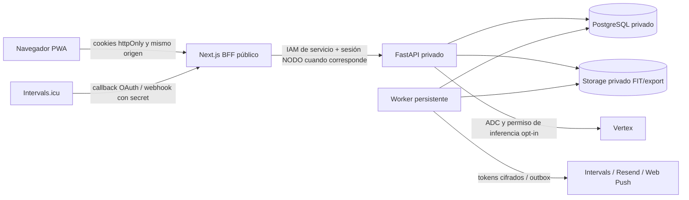

# Arquitectura de NODO y contratos operativos

Actualizado: 30 de septiembre de 2026. Describe el código integrado y la preparación de infraestructura, con pruebas locales y contratos de proveedor simulados. **No acredita despliegue, proveedor real conectado ni recuperación Cloud ejecutada.** La instrucción vigente excluye crear, modificar o desplegar recursos Google Cloud; Josué ejecutará las comprobaciones externas cuando tenga autorización y acceso a proyectos dedicados de NODO. Vibe Conversa queda fuera.

## Producto y módulos

NODO es una sola PWA Next.js en `frontend/apps/nodo-web`. NODO Lab es la experiencia del entrenador dentro de esa plataforma. Una persona puede tener roles atleta/coach y cambiar de contexto sin cambiar de cuenta; los permisos se resuelven siempre en el servidor por rol, organización, asignación y finalidad consentida. `nodo-lab` y `nodo-mobile` son referencias: no son otros clientes activos del piloto.

El backend FastAPI modular vive en `backend/api`:

| Capa | Responsabilidad |
|---|---|
| `api` | HTTP, schemas, sesión, permisos y control de versiones |
| `domain` | Cálculos deterministas, comparación y unidades |
| `services` | Casos de uso, privacidad, cola, almacenamiento y conectores |
| `infrastructure/database` | Modelos y persistencia PostgreSQL |
| `core` | Configuración, identidad y conexiones |

PostgreSQL 16 sustituye TimescaleDB conforme al ADR 0007. La telemetría usa partición nativa por rango de timestamp, clave `(activity_id,timestamp)`, índice BRIN y partición default. No se presupone una instalación de `pg_partman`/`pg_cron` ni mantenimiento automático de particiones por el solo hecho de aparecer en el ADR; esa operación debe comprobarse antes de escalar. Observaciones, cargas diarias y la cola son tablas persistidas del producto.

## Fronteras de acceso

La PWA conserva acceso/refresh en cookies `httpOnly`, `SameSite=Lax`, Secure en HTTPS; no guarda tokens en JavaScript o almacenamiento del navegador. El BFF exige `Origin` canónico en escrituras y aplica límites incrementales antes de parsear JSON/multipart o reenviar: 16 KiB sesión, 1 MiB JSON y 10 MiB FIT más 64 KiB de framing por defecto. `Content-Length` falso/ausente no elimina el límite. Una demo HTTP sólo admite una excepción explícita y loopback.

La cuenta de servicio PWA obtiene ID token de metadata para `X-Serverless-Authorization`; `Authorization` mantiene la sesión del usuario. La API permanece privada. Los callbacks y webhooks externos entran por la PWA pública y se relayean con IAM; conceder `allUsers` al backend no forma parte de este diseño.

## Datos, planificación y comparación

Organizaciones, membresías y asignaciones coach-atleta aíslan el acceso. Bloques y sesiones guardan pasos estructurados con tipo, repeticiones, duración/distancia, objetivo y unidad. Edición/publicación verifican `expected_version` en transacción; conflictos reciben `409`. El atleta lee sólo sesiones publicadas. Plantillas colectivas mantienen copias individuales, versiones y aplicación idempotente; recomendaciones conservan base y decisión explícita.

Actividades tienen dueño obligatorio, origen, hash/ID externo, fecha, laps y vínculo explícito a una sesión. La comparación emplea día local del atleta, disciplina y medidas compatibles; sólo compara laps cuando coincide su estructura. Datos insuficientes, disciplinas diferentes o varias actividades vinculadas se muestran como estados explícitos. No se infiere un triatlón combinando archivos ni se interpreta ausencia de datos como incumplimiento.

Observaciones conservan métrica, valor, unidad, método, fuente/dispositivo cuando existen, período, zona horaria, recepción, ID externo y calidad. Campos ausentes permanecen nulos; no se mezclan HRV SDNN/RMSSD, escalas vendor, TRIMP/TSS ni métricas de proveedores distintos. Check-ins subjetivos y molestias tienen identidad propia, historial y revisión; el cierre no certifica una conclusión médica.

## Ingesta, originales y retención

FIT entra autenticado y autorizado, con consentimiento deportivo. Se valida extensión/contenido, límite de 10 MiB y una sola sesión; decodificación/cálculo salen del event loop. Atleta/hash deduplican la importación. Actividad, telemetría, laps, auditoría y trabajo de carga diaria se guardan en transacción; el original debe conservarse antes de confirmar la importación fuera de desarrollo. Un error de almacenamiento devuelve un error sanitizado y revierte los registros.

El adapter de originales usa claves `fit/<athlete_id>/<sha256>.fit`; exportaciones usan `export/<athlete_id>/<sha256>.json`. API y worker comparten bucket GCS privado, sin URLs públicas ni firmadas: la descarga HTTP vuelve a comprobar permiso, finalidad y dueño de actividad, admite sólo `manual_fit` y responde `private, no-store`/`nosniff` con nombre fijo. El almacenamiento local queda limitado a desarrollo y ruta privada absoluta.

La retención deportiva se mide por fecha del evento; el TTL de originales se mide desde creación/ingesta del archivo. Reintentar contenido idéntico no debe renovar ese TTL. FIT y export tienen ventanas configurables distintas (365/30 días por defecto). Borrado de cuenta y limpieza de assets registrados enumeran versiones y eliminan cada generación vigente/no actual; errores de inventario/borrado mantienen pendiente el trabajo. La política preparada usa soft delete 0 para datos de usuario. Copias soft-deleted anteriores no desaparecen al cambiar la política y deben inventariarse antes de acreditar un borrado físico completo.

Carga diaria agrega todas las sesiones del día local, guarda fórmula/inputs vigentes y recalcula desde el día afectado por una llegada tardía. Los cálculos de forma incluyen descansos; un resumen sin cobertura suficiente no se presenta como certeza. Telemetría cruda se consulta para una actividad, no como sustituto del resumen diario del calendario.

## Cola persistente y entrega

La tabla PostgreSQL `jobs` es la cola de trabajo; el worker reclama pendientes/vencidos mediante `FOR UPDATE SKIP LOCKED`, renueva leases y revalida la reclamación antes de ejecutar. Transiciones terminales/reintentos usan estado, dueño y número de intento como condiciones. Un trabajo eliminado/cancelado o cuya reclamación ya cambió no puede completar la anterior. No se mantienen locks de Job durante llamadas de red; los handlers de datos/entrega revalidan User, consentimiento y payload tras los locks de privacidad.

Backoff, `run_after`, máximo de intentos y dead letters sobreviven al reinicio. Un envío diferido por horario vuelve a pendiente sin consumir otro intento de transporte. La entrega externa puede ser reintentada: sus handlers usan identidades/dedupe idempotentes; reclamar un job no acredita entrega única ni éxito del proveedor. Correo Resend, sincronización/desconexión Intervals, Web Push, borrado físico y retención consumen esta cola.

Heartbeat persiste en base y emite un `worker_health` JSON agregado cada 60 s. `job_failed`/`job_completed` registran tipo, intento y estado, sin cuerpos, destinatarios, IDs de atletas o secretos. `/admin/operations` requiere superusuario y expone revisión Alembic/heartbeat/cola; su lectura autenticada forma parte del smoke preparado.

## Asistentes y proveedor IA

Coach y atleta usan conversaciones persistidas, herramientas tipadas y contexto autorizado. El atleta sólo consulta su cuenta; el coach sólo sus asignaciones actuales. Contexto, historial y respuesta tienen límites explícitos y conservan citas, unidad, fuente y calidad. Texto de notas, archivos o proveedores es dato, nunca una instrucción que cambie permisos. Permiso/finalidad se vuelven a comprobar después de esperar al proveedor, al leer historial y al reutilizar una respuesta idempotente.

La IA genera texto y propuestas validadas. Las métricas/comparaciones salen de dominio determinista. Escribir una molestia propia o un borrador del coach requiere preview, hash, expiración, permisos y confirmación consumible una vez; el modelo no publica sesiones ni escribe métricas. `request_key` protege contra runs duplicados y detecta un payload diferente con la misma clave.

El adapter Vertex usa REST y ADC. La preparación Terraform habilita API y permiso mínimo de inferencia únicamente por opt-in en la cuenta API. Modelo/región, precios y topes requieren configuración explícita. `AssistantBudget` reserva solicitudes/tokens/costo entero microUSD por usuario y organización antes del proveedor; completa con uso reportado, conserva reserva prudente en error/cancelación y evita doble consumo al reproducir un resultado. El costo es estimado, no factura de Billing ni garantía de factura por modelo histórico. Timeout, cancelación de stream, cuota o salida inválida conservan la vía manual. Las pruebas HTTP usan mocks; ningún resultado local acredita llamada real de Vertex.

## Intervals.icu y notificaciones

Intervals.icu es el proveedor deportivo principal y FIT es respaldo permanente. El adapter implementa OAuth real: state de cinco minutos ligado a la sesión, uso único, scopes de lectura `ACTIVITY:READ`, `WELLNESS:READ`, `CALENDAR:READ`, token cifrado y callback público PWA. El contrato del proveedor no ofrece refresh token; inválido implica reconexión. Webhooks autentican `secret` del cuerpo, limitan tamaño/eventos y deduplican por conexión/atleta; no se presupone firma HMAC. Backfill configurado de 90 días y sync periódica revalidan acceso en cada ventana, preservan origen y excluyen Strava/orígenes no autorizados. Calendario externo es evidencia; no se publica un entrenamiento fuera de NODO.

Desconectar detiene ingesta, cancela trabajos y revoca remotamente. Si falla, una tarea cifrada independiente reintenta sin exponer token o revivir ingesta; FIT manual se conserva. Las rutas heredadas de conexión no permiten saltar este contrato. App OAuth/credenciales y pruebas reales de autorización, webhook, backfill, reconexión y desconexión quedan para Josué.

Web Push cifra suscripciones con una clave separada de OAuth/correo, valida hosts HTTPS y claves del dispositivo, respeta consentimiento/preferencias/horarios y entrega avisos genéricos sin datos deportivos. User y delivery se refrescan tras obtener lock para que revocación o borrado no revivan una entrega en memoria. El service worker no cachea API autenticada; su manejo push/click no concede acceso a datos.

## Privacidad y copia offline

Finalidades de procesamiento deportivo, asistente y push se registran por separado con versión. Desarrollo admite fixtures sin consentimiento, pero una revocación explícita siempre bloquea. Suspensión de organización/subscription cierra operaciones deportivas y conserva acceso de la persona a consentimiento/export/borrado. El borrado respeta FKs, purga derivados que referencian a la persona, revoca sesiones y desidentifica el registro necesario para relaciones financieras. El borrado físico/remoto pendiente no se llama completado por recibir `204`.

La PWA guarda únicamente una copia local acotada de sesiones publicadas del atleta para lectura offline, asociada a cuenta y con vencimiento máximo de 24 horas. No almacena tokens, chats, telemetría o datos de otros atletas. Logout, 401/403, cambio de cuenta, revocación y expiración invalidan tanto storage como estado montado; una respuesta HTTP de denegación no se sustituye por una copia. El fallback de detalle se reserva al fallo de transporte. Esta copia requiere consentimiento informado y QA en dispositivos compartidos.

## Infraestructura preparada y evidencia pendiente

`infra/environments/staging` y `prod` comparten módulo para proyectos dedicados, red, Cloud SQL privado, Storage, Artifact Registry, Secret Manager, IAM/WIF, API/PWA, migration job y worker pool. Workloads, worker, proveedores y alertas permanecen opt-in; versiones de secretos son numéricas y valores quedan fuera de Git/Terraform. Vertex no recibe API key ni llaves JSON. Los workflows de deploy conservan disparo manual; no se ejecutan durante esta preparación.

Alembic es la única vía de esquema. La cadena integrada llega a `0009_operations`; migraciones se ejecutan antes de tráfico, nunca mediante `create_all` al iniciar. La API `/health` sólo comprueba conexión. Demo Compose/corpus sintético y pruebas de migración validan desarrollo, no Cloud SQL real.

Backups lógicos preparados conservan 30 días más soft delete de siete días; Cloud SQL prepara 14 backups y siete días PITR. Restore siempre clona a instancia nueva; se mide provisión, luego integridad/readback y RTO/RPO funcionales por separado. Reaplicar ledger de borrado/revocación antes de abrir tráfico. No hay recuperación Cloud verificada en esta entrega.

Terraform y contratos sintéticos preparados no sustituyen proyecto/billing/ADC/WIF, configuración de proveedores, smoke público autenticado, alertas recibidas, prueba de restore ni aprobación legal/comercial. El runbook detalla bindings, costos, retención y evidencia SHA → CI → digest → migración → readback; el GO exige las compuertas de lanzamiento vigentes.

Referencias: [API](API_NODO.md), [plan maestro](PLAN_MAESTRO_NODO.md), [ADR](ADR/), [preparación operativa](RUNBOOK_PROVEEDORES_OPERACION.md), [handover](HANDOVER_JOSUE.md) y [lanzamiento](LANZAMIENTO.md).
